<div align="center">

# 🌐 gcp-network-connectivity-center

### Hands-On Hub-and-Spoke Networking · Producer VPC Spokes · PSC Connection Propagation · Google Cloud

[](https://cloud.google.com)
[](https://cloud.google.com/network-connectivity/docs/network-connectivity-center)
[](https://cloud.google.com/vpc/docs/private-service-connect)
[](https://cloud.google.com/compute)
[](https://cloud.google.com/sql)
[](#-real-issues-found--fixed)
[](LICENSE)

---

*A real, hands-on Network Connectivity Center (NCC) build across multiple GCP projects and VPCs: hub-and-spoke fundamentals, edge/centre group traffic rules, producer VPC spokes for private cross-project Cloud SQL access, and full PSC Connection Propagation behind an Internal Load Balancer — every behavior confirmed with real console screenshots against live GCP projects, not just described.*

</div>

---

## 📋 Table of Contents

- [Overview](#-overview)
- [Architecture](#-architecture)
- [What Was Built](#-what-was-built)
- [Repository Structure](#-repository-structure)
- [1. Hub-and-Spoke Fundamentals](#-1-hub-and-spoke-fundamentals)
- [2. Edge Groups vs Centre Groups](#-2-edge-groups-vs-centre-groups)
- [3. Producer VPC Spokes (Preview)](#-3-producer-vpc-spokes-preview)
- [4. PSC Connection Propagation](#-4-psc-connection-propagation)
- [Gotchas Reference Table](#-gotchas-reference-table)
- [Real Issues Found & Fixed](#-real-issues-found--fixed)
- [Pricing](#-pricing)
- [Snapshots](#-snapshots)
- [Resources](#-resources)

---

## 🌐 Overview

Network Connectivity Center (NCC) is Google Cloud's hub-and-spoke model for network connectivity management — instead of a full mesh of point-to-point VPC peerings, every VPC (or on-prem network, or producer service) attaches to a central **hub** as a **spoke**, and all spoke-to-spoke traffic transits through it.

This repo documents a real, hands-on build across multiple GCP projects that exercises essentially every core NCC capability — not just the happy path:

### 🔑 Key Facts

| Property | Value |
|---|---|
| ☁️ **Cloud Platform** | Google Cloud Platform, multiple projects (`hub-project111`, `spoke-project111`, `gcp-project-11111`, and more) |
| 🕸️ **Topology tested** | Mesh topology (Part 1–3) and Star topology with Edge/Centre groups (Part 2 & 4) |
| 🔀 **Spoke types tested** | VPC spokes, Producer VPC spokes (Preview), PSC-propagated spokes |
| 🔒 **Access pattern** | Cross-project, cross-VPC, cross-region private connectivity — VMs, Cloud SQL, and an Internal Load Balancer behind PSC |
| 🛡️ **Firewall model** | Default-allow rules explicitly verified on both sides — NCC does not bypass VM-level firewalls |
| 📸 **Evidence** | 17 curated real GCP Console screenshots — see [Snapshots](#-snapshots) |

### ✨ What Makes This Different

| Capability | Description |
|---|---|
| 🔁 **Full connectivity lifecycle, not a single demo** | Two VPCs unable to ping → Hub created → Spoke created on each side → manual accept vs. auto-accept both tested → live ping confirmed working |
| 🚫 **Negative cases tested, not just the happy path** | Overlapping subnets deliberately triggered to capture the real error; edge-to-edge ping deliberately tested to confirm it's blocked, not assumed |
| 🧵 **All three spoke categories, proven** | Plain VPC spokes (Part 1–2), Producer VPC spokes for Cloud SQL (Part 3), and PSC Connection Propagation spokes behind an ILB (Part 4) — each with a genuine before/after connectivity test |
| 🕵️ **Real gotchas, not staged ones** | The default-VPC incompatibility with producer/consumer NCC flows cost real debugging time before being traced back — see [Real Issues Found & Fixed](#-real-issues-found--fixed) |

### ❓ Why NCC?

Point-to-point VPC peering doesn't transit — every VPC needs a direct connection to every other VPC it talks to, and that mesh becomes unmanageable past a handful of networks. NCC replaces the mesh with a single hub:

| Benefit | How It Showed Up Here |
|---|---|
| **Centralized transit** | Once Hub + Spokes existed on both sides, routes populated automatically — no manual route configuration |
| **Segmentation via groups** | Edge groups can reach the Centre but never each other — confirmed by a deliberately-blocked edge-to-edge ping test |
| **Private cross-project access to managed services** | Producer VPC spokes let a Cloud SQL instance in one VPC be reached privately from other VPCs/projects, without Private Service Access's opaque Google-managed peering |
| **PSC at scale** | PSC Connection Propagation lets a single Private Service Connect endpoint (behind an ILB) become reachable from additional projects via the hub, instead of a dedicated PSC connection per consumer |
| **Fine-grained route control** | Exclude filters let you keep a sensitive subnet, or a specific overlapping range, out of what the hub advertises — verified by watching the route disappear from the hub's route table |

---

## 🏛️ Architecture

```
        Airport-hub analogy: every spoke (flight) routes through the
        hub (central airport) — spokes never connect to each other directly.

                         ┌───────────────────────────┐
                         │      NCC Hub (Project A)    │
                         │   Policy: Mesh or Star       │
                         └──────────────┬──────────────┘
                                        │
        ┌───────────────┬──────────────┼──────────────┬───────────────┐
        ▼               ▼              ▼              ▼               ▼
  ┌───────────┐   ┌───────────┐  ┌───────────┐  ┌────────────┐  ┌───────────────┐
  │ VPC Spoke  │   │ VPC Spoke  │  │ Producer   │  │ PSC-        │  │ Edge Group     │
  │ (Project B)│   │ (Project C)│  │ VPC Spoke  │  │ Propagated  │  │ Spokes         │
  │            │   │            │  │ (Cloud SQL)│  │ Spoke (ILB) │  │ (Star topology)│
  └───────────┘   └───────────┘  └───────────┘  └────────────┘  └───────────────┘
```

```
Part 1 — Hub + 2 VPC spokes (mesh)      → ping between VMs across projects works
Part 2 — Hub + Edge/Centre groups       → Edge↔Centre works, Edge↔Edge is blocked
Part 3 — Hub + Producer/Consumer spokes → Cloud SQL reachable privately, cross-project
Part 4 — Hub + PSC propagation spokes   → ILB-backed PSC endpoint reachable from 2nd project
```

### 🔄 Lab Environment Map

| Component | Role |
|---|---|
| `hub-project111` | Hosts the NCC Hub for Parts 1–2 (no VPC required on the hub project itself) |
| `spoke-project111` | Spoke VPC + test VM, used to validate cross-project connectivity |
| Producer/consumer projects (Part 3) | Cloud SQL + PSC endpoint on one VPC, consumer VMs on separate VPCs/projects |
| `gcp-project-11111` / `cloud-armor-demo` (Part 4) | Producer side: ILB + service attachment; consumer side: PSC endpoint + second-project spoke |

---

## 🏗️ What Was Built

| Resource | Part 1 | Part 2 | Part 3 | Part 4 |
|---|---|---|---|---|
| NCC Hub | ✅ Mesh | ✅ Star (Edge/Centre) | ✅ | ✅ Mesh, PSC propagation enabled |
| VPC + Subnet spokes | ✅ 2 projects | ✅ Multiple Edge + 1 Centre | — | ✅ 2 projects |
| Test VMs + ping validation | ✅ | ✅ | — | ✅ |
| Auto-accept vs manual accept | ✅ Both tested | — | — | ✅ Manual accept confirmed |
| Subnet overlap error | ✅ Triggered deliberately | — | — | — |
| Exclude filters (subnet/range) | ✅ | — | — | ✅ Route disappearance confirmed |
| Producer VPC spoke (Cloud SQL) | — | — | ✅ Consumer + Producer spokes | — |
| Internal Load Balancer + PSC service attachment | — | — | — | ✅ |
| PSC endpoint + Global Access | — | — | — | ✅ Cross-region gotcha confirmed |

---

## 📁 Repository Structure

```
gcp-network-connectivity-center/
│
├── docs/
│   └── snapshots/                  # Real GCP Console screenshots (see below)
│       ├── 01-hub-spoke-vpcs-created.png
│       ├── 02-vm-ping-connectivity-test.png
│       ├── 03-hub-auto-accept-projects.png
│       ├── 04-hub-routes-auto-populated.png
│       ├── 05-subnet-overlap-error.png
│       ├── 06-exclude-subnet-from-spoke.png
│       ├── 07-edge-to-edge-ping-blocked.png
│       ├── 08-centre-to-edge-spokes-and-ping.png
│       ├── 09-producer-spoke-sql-access-denied.png
│       ├── 10-producer-spoke-sql-access-granted.png
│       ├── 11-psc-ilb-backend-service.png
│       ├── 12-psc-published-service.png
│       ├── 13-psc-global-access-cross-region.png
│       ├── 14-ncc-hub-psc-propagation-toggle.png
│       ├── 15-ncc-spoke-inactive-pending-review.png
│       ├── 16-ncc-spokes-active-default-vpc-issue.png
│       └── 17-ncc-hub-route-after-exclude.png
│
└── README.md                       # This file
```

---

## 🔹 1. Hub-and-Spoke Fundamentals

**Setup:** two projects (`Hub`, `Spoke`), one VPC + subnet + test VM each, confirmed VMs **cannot** ping across VPCs by default.

| Step | Behavior confirmed |
|---|---|
| Create NCC Hub | The hub project itself doesn't need its own VPC |
| Create Spoke on each side | Connectivity does **not** come up until **both** sides have a spoke — one-sided setup isn't enough |
| Accept the spoke | Manual accept is the default; adding a project ID to the hub's **auto-accept** list (disabled by default) skips the manual step entirely |
| Check routes | Hub VPC's route table shows the Spoke's ranges **added automatically** — no manual route config |
| Firewalls | Not bypassed — traffic from the peer VPC still needs explicit allow rules |
| Overlapping subnets | Strictly disallowed — adding a spoke with a range that overlaps an existing hub range fails outright |
| Exclude filters | Exclude a whole subnet, or just the overlapping range on both sides, to work around overlap without an error |
| Backend mechanism | NCC does **not** create VPC peering behind the scenes — confirmed distinct from Private Service Access |

⚠️ **Tested edge case:** excluding a small sub-range (`/28`) from within a larger advertised range (`/24`) still produced an error — validate this pattern against your own CIDR plan before relying on it.

<table>
<tr>
<td width="50%">

**Hub & Spoke VPCs created**
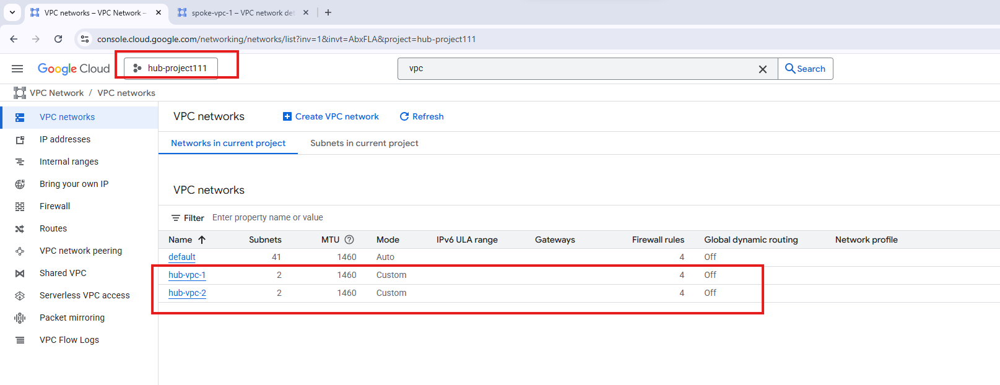

</td>
<td width="50%">

**Cross-VPC ping test between VMs**
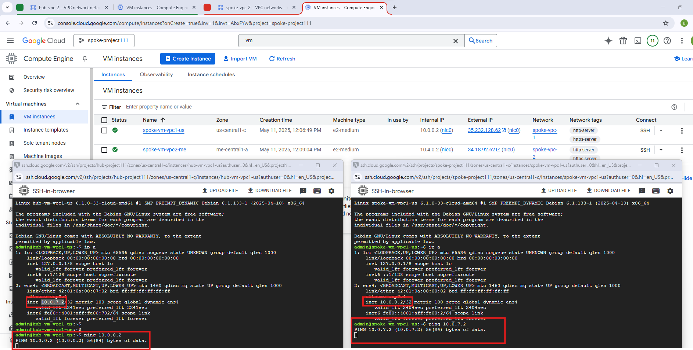

</td>
</tr>
<tr>
<td width="50%">

**Hub auto-accept projects list**
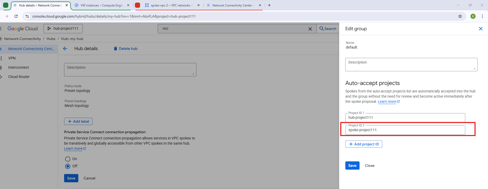

</td>
<td width="50%">

**Spoke routes auto-populated on the hub**
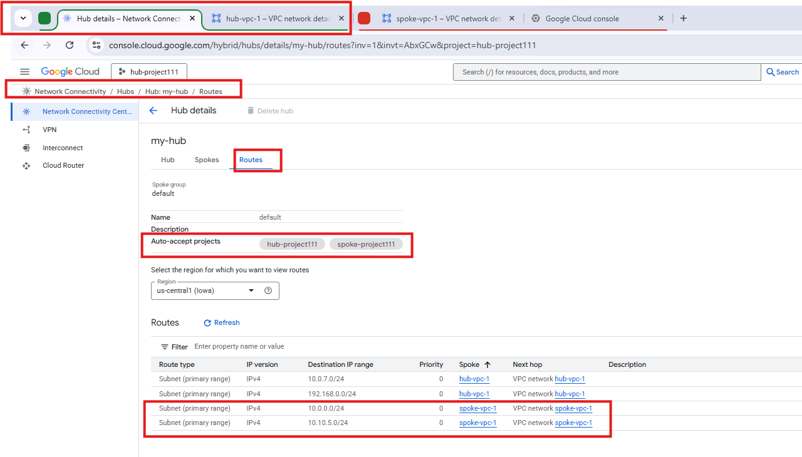

</td>
</tr>
<tr>
<td width="50%">

**Overlapping subnet — real error message**
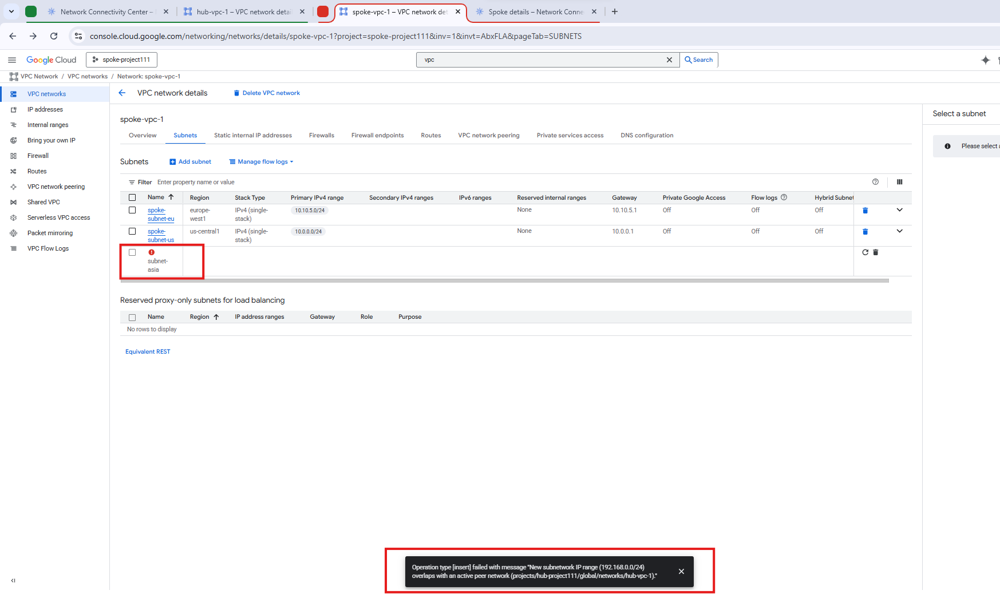

</td>
<td width="50%">

**Excluding a subnet from a spoke**
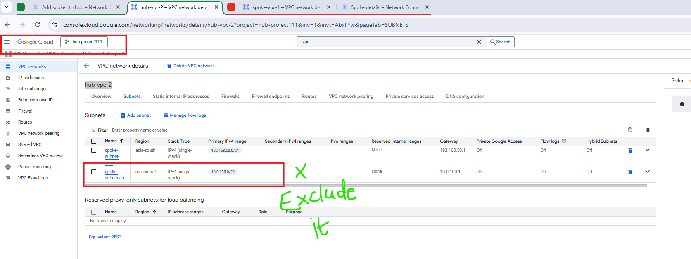

</td>
</tr>
</table>

---

## 🔹 2. Edge Groups vs Centre Groups

| Group | Can reach | Cannot reach |
|---|---|---|
| **Centre** | All groups (Edge and Centre) | — |
| **Edge** | Centre only | Other Edge groups |

Two spokes placed in **separate Edge groups** were confirmed to have **zero connectivity** between their VMs — this is enforced by NCC, not a misconfiguration. Adding a VPC spoke to the **Centre** group immediately gave that VM full any-to-any connectivity with every other group. Route tables only surface **Centre** routes — Edge routes aren't shown the same way, consistent with the traffic restriction.

**Use Edge groups** when spokes (e.g., branch networks) should reach a shared central resource but never talk laterally to each other. **Use the Centre group** when you need full mesh connectivity.

<table>
<tr>
<td width="50%">

**Edge-to-Edge ping — blocked by design**
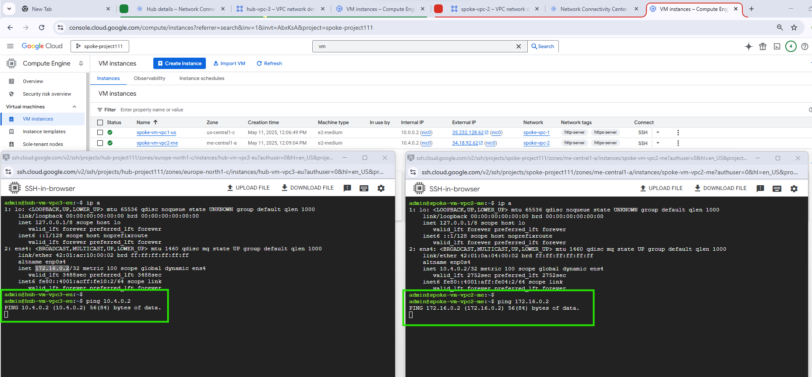

</td>
<td width="50%">

**Spoke groups table + Centre-to-Edge ping succeeding**
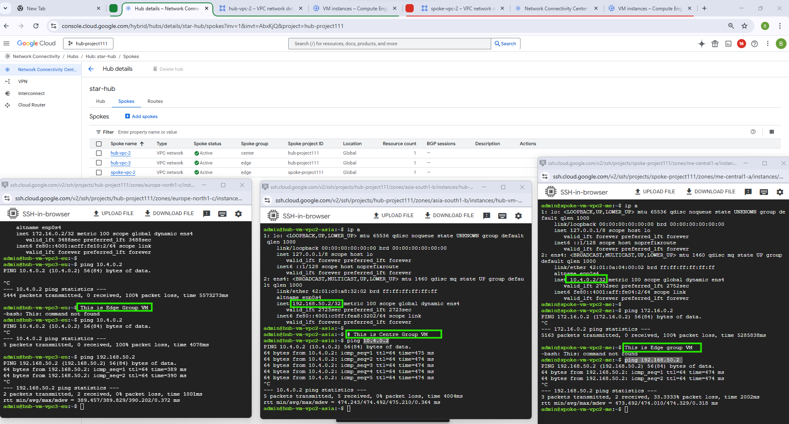

</td>
</tr>
</table>

---

## 🔹 3. Producer VPC Spokes (Preview)

**Why not Private Service Access?** PSA creates a VPC peering connection to a Google-managed VPC you can't see or control — fine for one consumer, awkward for sharing one producer resource (like Cloud SQL) across multiple projects. **Producer VPC spokes** route that access through the NCC hub instead.

**Sequence validated:**

1. Cloud SQL + PSC endpoint on `hub-vpc-1` — confirmed VMs in other VPCs **cannot** reach it yet.
2. Producer VPC spoke requires a **consumer VPC spoke** to exist first.
3. Created consumer spoke → still no access (producer spoke not yet created).
4. Created producer spoke → still no access if the requesting VM sits in a **different** VPC than the consumer spoke.
5. Created an additional spoke on that VM's VPC → **connectivity confirmed.**
6. Repeated for a second project — Cloud SQL wasn't reachable there either until that project also got its own spoke.

**Rule of thumb:** every VPC needing access — the producer's VPC and each consumer VPC — needs its own explicit spoke. There's no implicit reachability.

<table>
<tr>
<td width="50%">

**MySQL connection attempt — before spoke wiring**
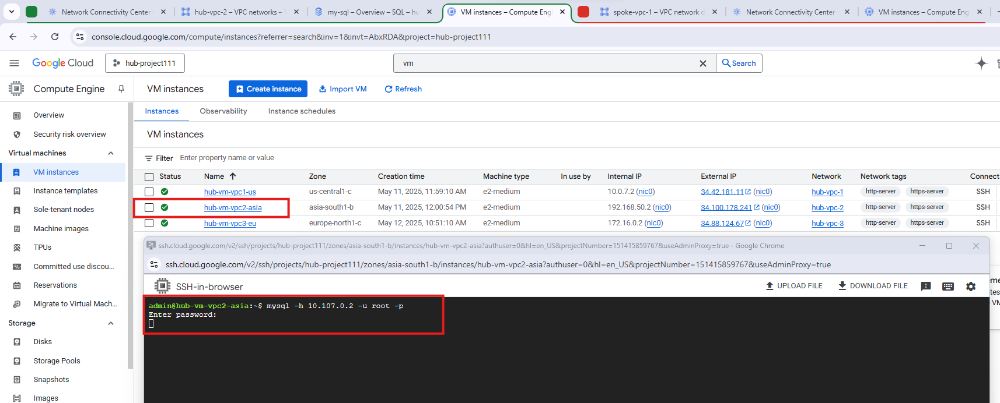

</td>
<td width="50%">

**MySQL connection succeeding — after producer + consumer spokes**
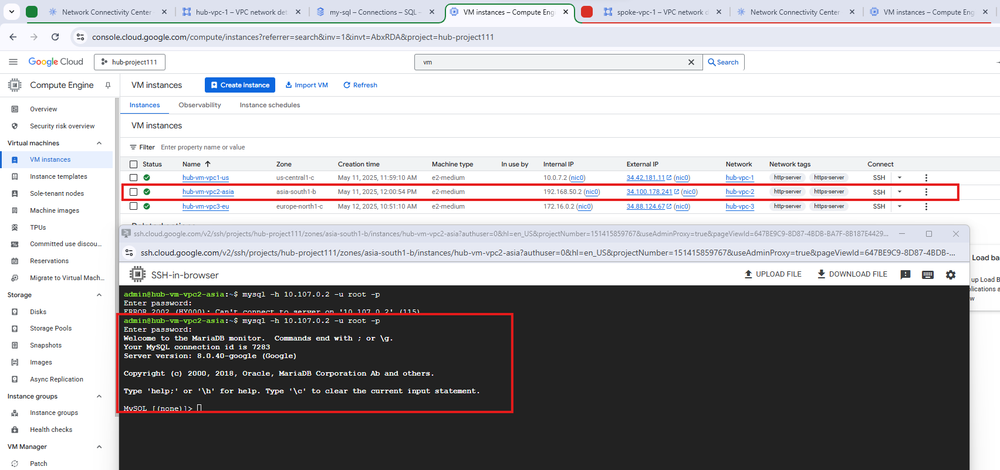

</td>
</tr>
</table>

---

## 🔹 4. PSC Connection Propagation

**Base PSC setup (before NCC):** two VMs behind an unmanaged instance group → Internal Load Balancer → **service attachment** on the producer VPC → **PSC endpoint** on the consumer VPC. A consumer VM could then reach the producer's web server.

⚠️ **Global Access gotcha:** the PSC connection was first created in one region with **Global Access disabled** — VMs in that region worked, VMs in other regions couldn't connect. Enabling Global Access fixed cross-region reachability immediately.

**Propagating via NCC:**

1. **NCC must be enabled** for PSC connection propagation to work at all — it does not function on PSC alone.
2. Created the NCC hub on the producer project, with **PSC connection propagation** explicitly turned **On** at hub-creation time.
3. Created a spoke in the second (consumer) project.
4. Spoke showed **Inactive, pending review** until it was manually accepted at the hub.
5. ⚠️ **Default VPC is not supported** for this flow — using it silently broke connectivity even with active spokes on both sides. Recreating with a non-default VPC resolved it.
6. **Exclude filters** were re-tested here too: removing a spoke and re-adding it with an excluded range (`10.0.7.0/24`) made that range **disappear from the hub's route table**, confirmed directly.

<table>
<tr>
<td width="50%">

**ILB backend service creation**
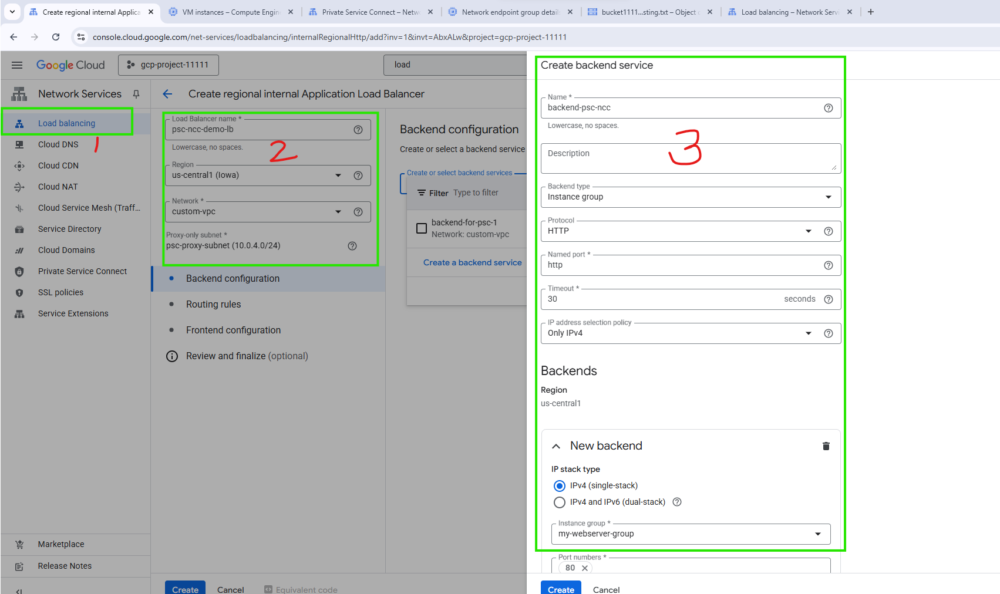

</td>
<td width="50%">

**PSC published service (service attachment)**
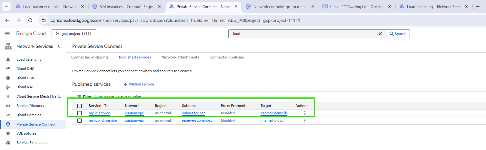

</td>
</tr>
<tr>
<td width="50%">

**Global Access disabled — cross-region access fails, then works**
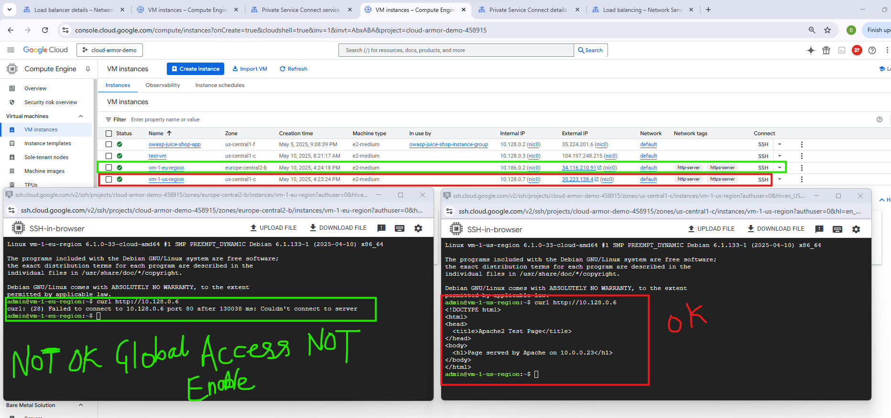

</td>
<td width="50%">

**NCC hub creation — PSC connection propagation toggle**
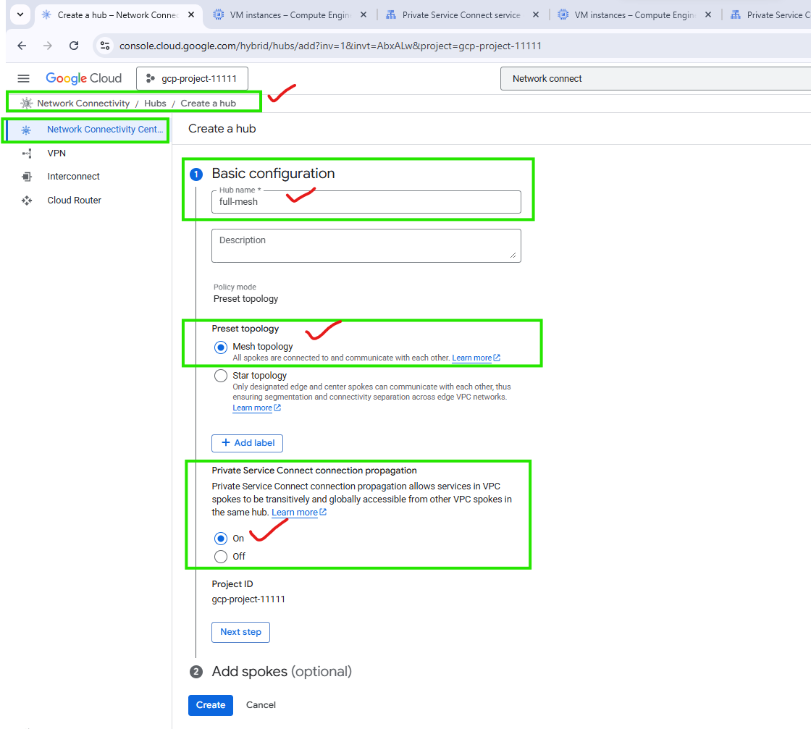

</td>
</tr>
<tr>
<td width="50%">

**Spoke inactive, pending review at the hub**
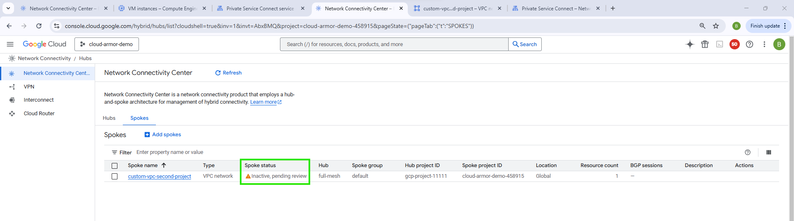

</td>
<td width="50%">

**Spokes active — still failing due to default VPC**
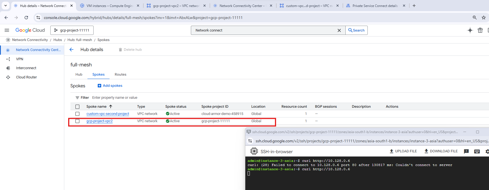

</td>
</tr>
</table>

**Hub route table after excluding a range from the spoke:**

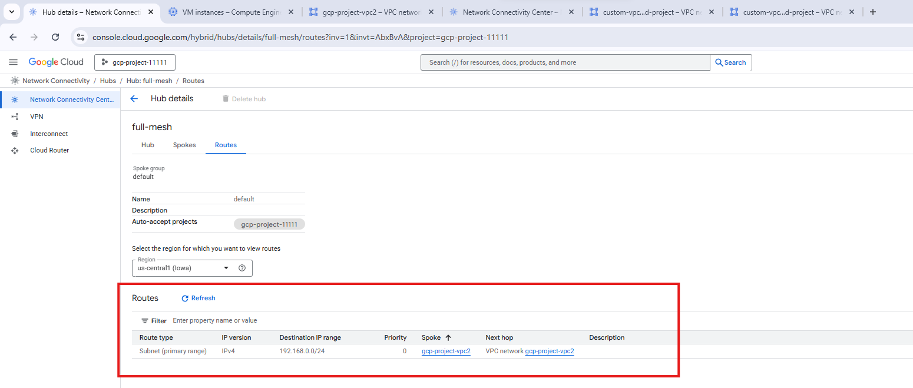

---

## 🛡️ Gotchas Reference Table

| Area | Gotcha |
|---|---|
| Spoke acceptance | Manual by default; enable auto-accept per project ID to skip it |
| Connectivity | Requires a spoke on **both** sides — one-sided setup never connects |
| Firewalls | Not bypassed by NCC — allow the peer VPC's ranges explicitly |
| Overlapping subnets | Disallowed outright; use exclude filters on one or both sides |
| Partial-range excludes | A small sub-range excluded from a larger advertised range can still error — test first |
| Edge groups | No edge-to-edge traffic; edge-to-centre only |
| Producer VPC spokes | Every VPC needing access — producer and each consumer — requires its own spoke |
| PSC Global Access | Required for cross-region reachability |
| PSC + NCC | Connection propagation needs NCC enabled; doesn't work on PSC alone |
| Default VPC | Not supported for producer/consumer NCC flows — silently breaks connectivity |
| Backend mechanism | NCC does not create VPC peering under the hood |

---

## 🕵️ Real Issues Found & Fixed

Not staged for the README — these came up during the actual build, each with a real root cause identified before the fix.

| Issue | Root Cause | Fix |
|---|---|---|
| Hub-and-spoke VMs still couldn't ping after creating one spoke | Only one side (the Hub project) had a spoke created — the Spoke project's own spoke didn't exist yet | Created the second spoke; connectivity came up automatically once both existed |
| New spoke rejected with an overlap error | Spoke VPC's subnet range duplicated an existing Hub VPC subnet range exactly | Used an exclude filter on the overlapping range on both sides instead of changing the CIDR plan |
| Excluding a `/28` from within an advertised `/24` still errored | Exclude ranges have their own constraints relative to the parent advertised range — not just "any sub-range works" | Verified the specific exclude pattern in the console before relying on it in design |
| Edge VM couldn't reach another Edge VM even with both spokes Active | Edge-to-edge traffic is blocked by NCC's group model, not a misconfiguration | Moved the shared destination into the Centre group where full mesh was needed |
| Cloud SQL unreachable from a second project despite the first project's spokes being correctly wired | Producer VPC spokes don't grant implicit reachability — the second project had no spoke of its own yet | Created a matching spoke in the second project |
| PSC endpoint unreachable from a VM in a different region | Global Access was left disabled on the PSC connection, which was created region-scoped | Enabled Global Access |
| PSC Connection Propagation spoke stuck at "Inactive, pending review" | Manual accept is the default at the hub; the spoke hadn't been accepted yet | Accepted the spoke at the hub (or would configure auto-accept for repeat setups) |
| PSC propagation still failing with both spokes Active | The first VPC in the flow was the `default` VPC — not supported for producer/consumer NCC flows | Rebuilt using a non-default VPC from the start |

---

## 💰 Pricing

- **Hub:** free
- **Spoke:** billed per VPC, per hour

See the [official pricing page](https://cloud.google.com/network-connectivity/docs/network-connectivity-center/pricing) for current rates before estimating at scale.

---

## 📸 Snapshots

Real screenshots taken directly from the Google Cloud Console while building this lab — not staged, all under [`docs/snapshots/`](docs/snapshots).

### Part 1 — Hub-and-Spoke Fundamentals


### Part 2 — Edge Groups vs Centre Groups


### Part 3 — Producer VPC Spokes


### Part 4 — PSC Connection Propagation


---

## 🔗 Resources

- [Network Connectivity Center overview](https://cloud.google.com/network-connectivity/docs/network-connectivity-center)
- [NCC Part 1 — Hub-and-Spoke Basics (video)](https://www.youtube.com/watch?v=KqoJF2MrIbw)
- [NCC Part 2 — Edge & Centre Groups (video)](https://www.youtube.com/watch?v=lylJoMHYDgk)
- [Producer VPC Spokes — Preview (video)](https://www.youtube.com/watch?v=4PgFTRhEvGQ)
- [PSC Connection Propagation — Part 4 (video)](https://www.youtube.com/watch?v=RNzBLn8Tz6g)
- [NCC pricing documentation](https://cloud.google.com/network-connectivity/docs/network-connectivity-center/pricing)

---

<div align="center">

**Maintained by Bikram Singh**

*Built and verified hands-on with Google Cloud Network Connectivity Center*

</div>
